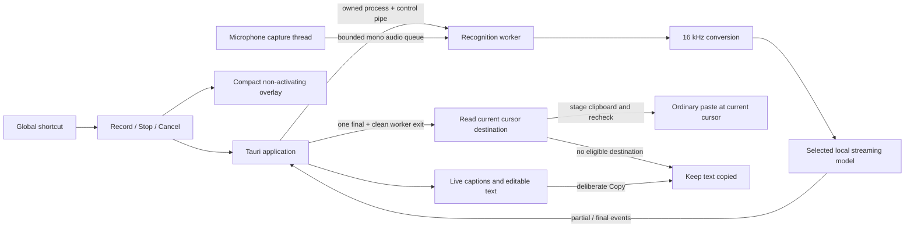

# Logia

Local voice dictation for the desktop, with live captions and careful delivery to the intended text field.

**Personal preview:** a macOS app records English speech, shows live captions, and pastes the finished text at your current text cursor. The transcript stays on the clipboard if the destination cannot accept it. Recognition runs locally in an owned worker process. Windows and Linux desktop support remains planned and unvalidated.

## Run the app

Requirements: macOS 14+, Apple developer tools, Rust, CMake, Node.js, and pnpm. The current native build has been checked on Apple Silicon.

```sh
cd apps/desktop
pnpm install --frozen-lockfile
pnpm tauri dev
```

Complete the two permission steps in Settings and download the English model once (199 MB). Each permission step shows one action appropriate to its current state; returning from System Settings refreshes the status automatically. **Voice test** is a separate diagnostic tool, not the main dictation workflow.

Once ready, your global shortcut starts dictation in a compact overlay while you work in another app. Press it again while listening to stop. The default is **Control–Option–Space**; **Settings → General → Global shortcut** offers Control–Option–Space, Control–Shift–Space and Option–Shift–Space, and a binding that fails to register is never saved. The overlay is a separate non-activating panel with no title bar or controls of its own: it floats above ordinary windows, never takes keyboard focus from the field you are dictating into, and stays out of window cycling. **Overlay position** places it at the bottom or top of the screen. A shortcut conflict shows a retry control; the deliberate voice test in Settings remains usable. Hold-to-talk is later work.

Logia runs as a menu-bar utility on macOS. After model setup, launch prepares recognition in the background; use the shortcut to dictate or the menu-bar icon → **Open Logia** for setup and text recovery. Closing an idle window hides it and retains its in-memory text. **Quit Logia** exits and stops its worker. Start from the desired text field with the global shortcut and use the shortcut again to stop. A new global session checks Microphone and Accessibility access first; revoked access returns to the relevant setup step. Stop remains available even if permission changes during a recording. The deliberate Voice test stays copy-only.

On launch, the app prepares native recognition using generated silence before enabling Record. This preparation never opens a microphone. You can cancel it; the next recording can still initialize the recognizer normally. Device audio is collected into bounded chunks and, after conversion, fed to recognition in consistent 64 ms blocks regardless of microphone sample rate. Stop flushes the remaining audio rather than losing the last short callback.

For a standalone local app, run `pnpm app:install` in `apps/desktop`. It builds, signs, replaces `/Applications/Logia.app`, verifies the installed executable and signature, then opens it normally. The installer archives the previous app and development bundle outside Applications, leaving one installed app. Never copy a `.app` into an existing `.app`: that nests the new build inside the old bundle and invalidates its signature. `pnpm app` builds without installing. Native inference remains optimized in this debug preview.

Local development signing is separate from public distribution. To create a persistent local signing identity, explicitly run `pnpm signing:setup` once. This imports a code-signing certificate and private key into your login keychain, permits `/usr/bin/codesign` to use that key, and does not change trust settings or privacy grants. Future `pnpm app` builds reuse it automatically; `LOCAL_SIGNING_IDENTITY` can select an existing identity instead. Without either identity the build uses ad-hoc signing and warns that macOS permissions may need granting again after an update. A fixed bundle identifier alone does not preserve an ad-hoc signature's identity. No Apple Developer ID or notarization is configured for public distribution.

The preview supports passages up to 60 seconds, keeps no transcript history, and saves no recordings. Captions can revise until finalization; recognition errors can still occur. The model download uses a pinned revision and verified SHA-256. After download, recognition requires no network connection.

The overlay keeps your words through pauses; it never shrinks or truncates mid-session. It shows about two lines by default and holds the whole transcript, which you can scroll back through or expand deliberately. An idle indicator can be enabled in Settings. Received words appear progressively within 140 ms; corrections update in place, and final text appears immediately. Reduced-motion preferences disable that pacing. Long passages follow the latest words until you scroll back. The meter reflects measured audio level, and sustained silence shows a warning. Vocabulary rules replace exact spoken phrases in final text. Opt-in history and hold-to-talk remain planned.

**Settings → Models** offers Moonshine Streaming Small (199 MB, default), Moonshine Streaming Medium (296 MB), and Parakeet Unified EN (731 MB). All three provide English live captions; Parakeet uses buffered chunks. Downloading does not change the active model: choose **Use model** to select an installed alternative. Selection persists across launches and drives both warmup and recording. Model changes are blocked while recognition runs, and the active model cannot be removed. Downloads have pinned revisions, exact sizes and SHA-256 checks; failed downloads leave the existing artifact and selection intact. Parakeet v3 remains unavailable because this runtime supports it only for batch transcription. Model import and comparative quality/language evaluation remain planned; a larger model is not a quality guarantee.

Logia chooses the destination when the finished transcript is ready. Moving your cursor or switching apps while speaking changes where it will paste. All eligible apps use ordinary Command-V; an app does not need to support Accessibility text writes or belong to a supported-app list. The current process/window and any available field/selection metadata are checked immediately before dispatch. Known secure or nontext controls, secure-input mode, unavailable app/window identity and Logia's own window use clipboard recovery. Missing field metadata alone does not block paste. If an app hides whether it has a text cursor, Logia can post ordinary paste but cannot detect whether it was accepted; the transcript remains on the clipboard and in Recovery.

Native checks cover AppKit text views, custom editors with hidden Accessibility fields, Chrome input/textarea/contenteditable, and Apple Terminal. Specific Electron apps, tmux logical panes, other keyboard layouts, Spaces/fullscreen and multiple displays still need desktop acceptance. The overlay remains non-activating; a detected failure to appear on the active Space refuses recording.



Stop cuts off capture independently of inference and drains queued audio. Cancel invalidates the session before killing and reaping its worker. A replacement cannot start until the previous worker exits and delivery finishes. Once delivery begins, it cannot be retracted; a Cancel racing that boundary retains and reports the final outcome. “Paste sent” means one paste shortcut was dispatched, not that the app acknowledged receipt. Production never reads field contents. No Enter is sent and a dispatched paste is never retried. Text containing newlines or control characters is copied without automatic paste, because unknown terminal editors can interpret it as commands. Final focus checks and insertion cannot be atomic; apps can change focus after the last check. A clipboard changed since recording began is left alone, with the transcript retained for deliberate Copy. Known browser accessibility is prepared opportunistically, but does not determine paste support. The model loads per recording in this preview.

Checks, from the repository root:

```sh
cargo test --manifest-path apps/desktop/src-tauri/Cargo.toml --locked
cargo clippy --manifest-path apps/desktop/src-tauri/Cargo.toml --locked --all-targets -- -D warnings
```

For browser interaction checks, run `pnpm dev` in `apps/desktop`, then `pnpm exec playwright install chromium` and `pnpm test:ui` in another terminal there. Run `pnpm test:transcript` with Node.js 24+ for deterministic presentation checks. These test the UI contract; they do not test recognition quality. A developer can separately run the native executable with `--recognizer MODEL.gguf TEST.wav` on a non-sensitive 16-bit PCM WAV, up to 60 seconds. That explicit test mode writes recognition events to stdout; it never opens a microphone.

Run `bash scripts/test-global-paste.sh` for native current-cursor delivery checks, including custom editors that expose no Accessibility field, focus changes during final verification, clipboard recovery and canceled/duplicate attempts. It opens only owned synthetic windows and uses no microphone. `bash scripts/test-terminal-delivery.sh` checks Apple Terminal with a raw-input receiver that never executes received text.

For the Mac window integration check, build the synthetic fixture and run the separate example. It opens and closes its own windows, contains no microphone commands, and requires the test fixture to keep focus briefly:

```sh
bash scripts/test-overlay.sh
cargo run --manifest-path apps/desktop/src-tauri/Cargo.toml --locked --example delivery_smoke -- spikes/target-identity/.build/debug/target-fixture
```

The delivery example exercises the Rust command boundary with an owned fixture: current-cursor paste, clipboard fallback and rejected canceled/duplicate/invalid attempts. It requires Accessibility access but never requests permission or activates the microphone automatically. The Swift target core is linked into Logia itself so production delivery uses Logia’s permission identity.

`bash scripts/test-browser-delivery.sh` runs the production target bridge against a temporary Chrome profile with synthetic input, textarea, and contenteditable fields. It asserts actual resulting text after field/caret changes and recreation, plus cancellation, clipboard ownership and unchanged secure/read-only contents. Chrome and the desktop development dependencies must already be installed. This check uses no microphone and closes only its owned browser.

The interface, native app icon, and menu-bar template share one vector mark at `apps/desktop/src/brand/mark.svg`. Run `pnpm icons` in `apps/desktop` to regenerate the checked-in native assets using the pinned development tools.

## Target-identity probe

This separate feasibility probe compares application/window/text-field identity at two points in time. It retains its original strict identity semantics; the product now chooses the current cursor at delivery instead of locking the recording-start field. The probe does not record audio, read field contents, write the clipboard, or insert text.

Requirements for this experiment: macOS 14 or newer, Swift 6 or newer, and Apple developer tools.

```sh
swift build --package-path spikes/target-identity
bash scripts/test-target-probe.sh
swift run --package-path spikes/target-identity target-probe --help
```

Start with the automatic native check:

```sh
bash scripts/check-target-identity.sh
```

It briefly opens a synthetic window, checks unchanged/switched/recreated fields plus secure/read-only rejection, and closes it. Leave that window focused while it runs. A generic `unknown` cannot pass the positive controls. These checks have passed on macOS 26.4; they establish behavior in the AppKit fixture, not compatibility with Chrome, Electron, or other applications.

For an observation in another application, launch the probe, focus a sample field during the first delay, then perform a focus change during the second delay:

```sh
swift run --package-path spikes/target-identity target-probe \
  --case same-window-switch \
  --capture-delay-ms 3000 \
  --recheck-delay-ms 3000 \
  --output /tmp/logia-target-case.json
```

The output file must not already exist. If Accessibility access is unavailable, the probe exits with instructions; it does not request permission automatically. Unit tests need no Accessibility access. The synthetic fixture at `spikes/target-identity/fixtures/fields.html` provides two fields and an element-recreation case.

Identity comparison is a feasibility experiment, not proof of safe insertion. Native results must be checked against observed behavior; matching references cannot establish atomic verification and delivery.

Capture failures include their stage and Accessibility error code. Missing subroles are allowed for ordinary text areas; secure fields and unreadable metadata remain excluded. Process identity uses kernel start time so standalone helpers do not require Launch Services registration.

## Recognition transport

`spikes/recognition` contains versioned bounded messages, PCM framing, a bounded audio queue, stale-result rejection, preview coalescing, and an exact consumed-frame completion barrier. These experimental transport primitives are separate from the app's current capture-in-worker implementation.

```sh
cargo test --manifest-path spikes/recognition/Cargo.toml --locked
cargo clippy --manifest-path spikes/recognition/Cargo.toml --locked --all-targets -- -D warnings
```

## Direction

1. Maintain the working Mac global dictation preview with automatic build and regression checks.
2. Evaluate the available models; add microphone choice, hold-to-talk, longer sessions and model reuse.
3. Add bounded opt-in history and diagnostics, then validate Windows/Linux desktop integration and public distribution.

See [CONTRIBUTING.md](CONTRIBUTING.md) for development and data-handling rules.
