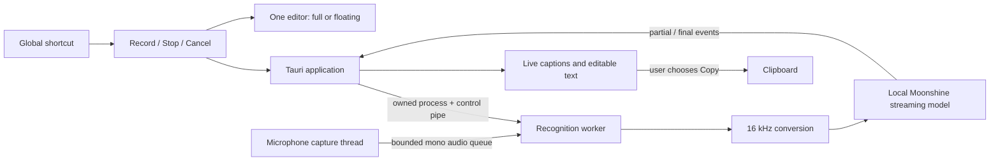

# Logia

Local voice dictation for the desktop, with live captions and careful delivery to the intended text field.

**Personal preview:** a macOS app now records English speech, shows real live captions, and lets you edit and copy the final text. Recognition runs locally in an owned worker process. Windows and Linux desktop support remains planned and unvalidated.

## Run the app

Requirements: macOS 14+, Apple developer tools, Rust, CMake, Node.js, and pnpm. The current native build has been checked on Apple Silicon.

```sh
cd apps/desktop
pnpm install --frozen-lockfile
pnpm tauri dev
```

Download the English model in the app once (199 MB), then choose **Start recording**. Grant Microphone permission when macOS asks. **Stop recording** finishes the text; **Cancel** discards it and terminates recognition. Edit the result and choose **Copy text**. Command–Enter starts/stops recording while this window is focused.

Once ready, **Command–Shift–Space** starts dictation in a floating window while you work in another app. Press it again while listening to stop. **Float window** and **Expand window** switch views without replacing the paragraph. The floating window stays above ordinary windows and stays open after Stop; drag, resize, or minimize it using its native title bar. A shortcut conflict shows a retry control; the normal recording buttons remain usable. The preview uses a fixed toggle shortcut; customization and hold-to-talk are later work.

On launch, the app prepares native recognition using generated silence before enabling Record. This preparation never opens a microphone. You can cancel it; the next recording can still initialize the recognizer normally. Device audio is collected into bounded chunks and, after conversion, fed to recognition in consistent 64 ms blocks regardless of microphone sample rate. Stop flushes the remaining audio rather than losing the last short callback.

Build a standalone local app with `pnpm tauri build --debug --bundles app`. It appears at `src-tauri/target/debug/bundle/macos/Logia.app`. The native inference library remains optimized in this debug preview. A signing identity is not configured for public distribution.

The preview supports passages up to 60 seconds, keeps no transcript history, and saves no recordings. Captions can revise until finalization; recognition errors can still occur. The model download uses a pinned revision and verified SHA-256. After download, recognition requires no network connection.

Both window sizes use the same persistent paragraph while recording, through pauses, and after Stop. Received words appear progressively within 140 ms; corrections update in place, and final text appears immediately. Reduced-motion preferences disable that pacing. Long passages follow the latest words until you scroll back; choose **Follow latest words** to resume following. Verified insertion into other applications, vocabulary support, history, and other language models are later work.

Mac native checks cover shortcut registration, revealing the background/minimized window without changing the foreground app, and restoring editor size. Spaces/fullscreen and multiple displays still need desktop acceptance; a detected failure to appear on the active Space refuses shortcut capture. No Accessibility permission or automatic insertion is added by the shortcut.



Stop cuts off capture independently of inference and drains queued audio. Cancel invalidates the session before killing and reaping its worker. A replacement cannot start until the previous worker exits. The model loads per recording in this preview.

Checks, from the repository root:

```sh
cargo test --manifest-path apps/desktop/src-tauri/Cargo.toml --locked
cargo clippy --manifest-path apps/desktop/src-tauri/Cargo.toml --locked --all-targets -- -D warnings
```

For browser interaction checks, run `pnpm dev` in `apps/desktop`, then `pnpm exec playwright install chromium` and `pnpm test:ui` in another terminal there. Run `pnpm test:transcript` with Node.js 24+ for deterministic presentation checks. These test the UI contract; they do not test recognition quality. A developer can separately run the native executable with `--recognizer MODEL.gguf TEST.wav` on a non-sensitive 16-bit PCM WAV, up to 60 seconds. That explicit test mode writes recognition events to stdout; it never opens a microphone.

For the Mac window integration check, build the synthetic fixture and run the separate example. It opens and closes its own windows, contains no microphone commands, and requires the test fixture to keep focus briefly:

```sh
swift build --package-path spikes/target-identity
cargo run --manifest-path apps/desktop/src-tauri/Cargo.toml --locked --example window_smoke -- spikes/target-identity/.build/debug/target-fixture
```

## Target-identity probe

The probe compares the focused application, window, and accessible text-field identity at two points in time. Changed or unavailable identity cannot qualify for automatic insertion. It does not record audio, read field contents, write the clipboard, or insert text.

Requirements for this experiment: macOS 14 or newer, Swift 6 or newer, and Apple developer tools.

```sh
swift build --package-path spikes/target-identity
bash scripts/test-target-probe.sh
swift run --package-path spikes/target-identity target-probe --help
```

Start with the automatic native check:

```sh
bash scripts/check-target-identity.sh
```

It briefly opens a synthetic window, checks unchanged/switched/recreated fields plus secure/read-only rejection, and closes it. Leave that window focused while it runs. A generic `unknown` cannot pass the positive controls. These checks have passed on macOS 26.4; they establish behavior in the AppKit fixture, not compatibility with Chrome, Electron, or other applications.

For an observation in another application, launch the probe, focus a sample field during the first delay, then perform a focus change during the second delay:

```sh
swift run --package-path spikes/target-identity target-probe \
  --case same-window-switch \
  --capture-delay-ms 3000 \
  --recheck-delay-ms 3000 \
  --output /tmp/logia-target-case.json
```

The output file must not already exist. If Accessibility access is unavailable, the probe exits with instructions; it does not request permission automatically. Unit tests need no Accessibility access. The synthetic fixture at `spikes/target-identity/fixtures/fields.html` provides two fields and an element-recreation case.

Identity comparison is a feasibility experiment, not proof of safe insertion. Native results must be checked against observed behavior; matching references cannot establish atomic verification and delivery.

Capture failures include their stage and Accessibility error code. Missing subroles are allowed for ordinary text areas; secure fields and unreadable metadata remain excluded. Process identity uses kernel start time so standalone helpers do not require Launch Services registration.

## Recognition transport

`spikes/recognition` contains versioned bounded messages, PCM framing, a bounded audio queue, stale-result rejection, preview coalescing, and an exact consumed-frame completion barrier. These experimental transport primitives are separate from the app's current capture-in-worker implementation.

```sh
cargo test --manifest-path spikes/recognition/Cargo.toml --locked
cargo clippy --manifest-path spikes/recognition/Cargo.toml --locked --all-targets -- -D warnings
```

## Direction

1. Try the Mac recording/captions/copy loop and improve actual microphone behavior.
2. Validate Chromium/Electron field identity, then add verified delivery with Copy fallback and explicit vocabulary support.
3. Add configurable controls, opt-in local history and beta features, then validate Windows and Linux integrations.

See [CONTRIBUTING.md](CONTRIBUTING.md) for development and data-handling rules.
